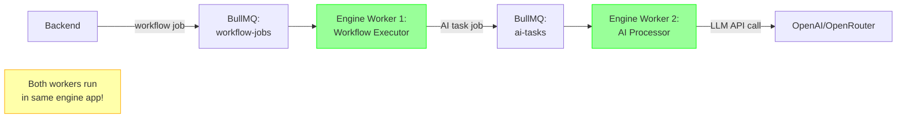

```mermaid
flowchart LR
    B[Backend] -->|workflow job| Q1[BullMQ:<br/>workflow-jobs]
    Q1 --> E1[Engine Worker 1:<br/>Workflow Executor]
    E1 -->|AI task job| Q2[BullMQ:<br/>ai-tasks]
    Q2 --> E2[Engine Worker 2:<br/>AI Processor]
    E2 -->|LLM API call| LLM[OpenAI/OpenRouter]
    
    style E1 fill:#9f9,stroke:#0f0
    style E2 fill:#9f9,stroke:#0f0
    
    note1[Both workers run<br/>in same engine app!]
    style note1 fill:#ffa,stroke:#fa0
```